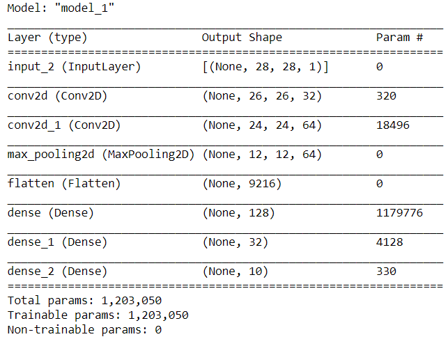

# Build a neural net 
## Homework assignment from bootcamp
In this lab, you'll create a submission to [Kaggle's Digit Recognizer](https://www.kaggle.com/c/digit-recognizer) competition using a neural network you've built in Keras.

From Kaggle:

> MNIST ("Modified National Institute of Standards and Technology") is the de facto “hello world” dataset of computer vision. Since its release in 1999, this classic dataset of handwritten images has served as the basis for benchmarking classification algorithms. As new machine learning techniques emerge, MNIST remains a reliable resource for researchers and learners alike.

> In this competition, your goal is to correctly identify digits from a dataset of tens of thousands of handwritten images. We’ve curated a set of tutorial-style kernels which cover everything from regression to neural networks. We encourage you to experiment with different algorithms to learn first-hand what works well and how techniques compare.

## Data:
I downloaded the MINST data from the Kaggle website. The data was in the format of a CSV file that contained 785 columns and 42000 rows. The first column was the label, ie. which number was written. Each of the other columns contained a number between 0 and 255. These numbers represent the "color" of each of the 784 pixels in a 28x28 pixel image of a handwritten number, with 0 representing white and 255 representing black. 

## Results:

Here is the model that a built:

Here are some of the predictions that it generated:

I got a 0.98110 on Kaggle.
